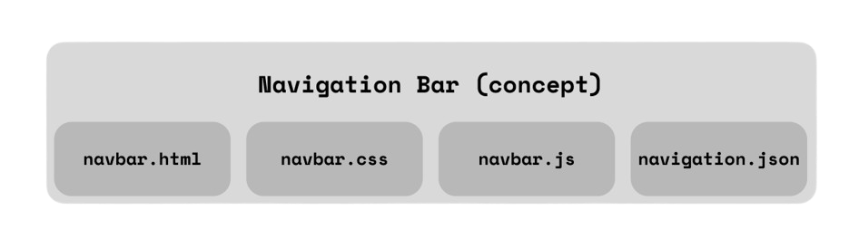

### 27/11/2025
<ol>
    <li>Initalised the directory files</li>
    <li>Asked CODEX to explain the package.json->dev-server.js relation</li>
</ol>

 

    Through CODEX I learnt we could have a static file server (dev-server.js) serve a folder (public).  
    We use common MIME types (media types) like text/html, text/css, application/javascript, image/png... etc...  
    We basically have dev-server.js saying "These are the files we're using, Browser" so the Browser knows how to handle

 

    The navbar skeleton has the basic form of:  
    <li>Fetches skeleton (navbar.html)</li>
    <li>Fetches the data/directory of pages (navigation.json)</li>
    <li>Injects links into the skeleton (navigation.json->navbar.html)</li>
    <li>Inserts it into the header</li>
    The navbar communicates through multiple files.

    You can refer to the above image to visualise that the concept of a navbar relies on multiple files.  
    I chose to split it up so we don't couple multiple things into one file

### 28/11/2025

    The 'location' element in the center navbar does the following:  
    <li> Takes the pathname, breaks it into core components, and prepends the root '~' symbol </li>
    <li> Then we just iterate through each crumb, define it's text, and index. </li>
    <li> Then insert the text ONLY, check for next index, if true, then add '/' divider </li>

